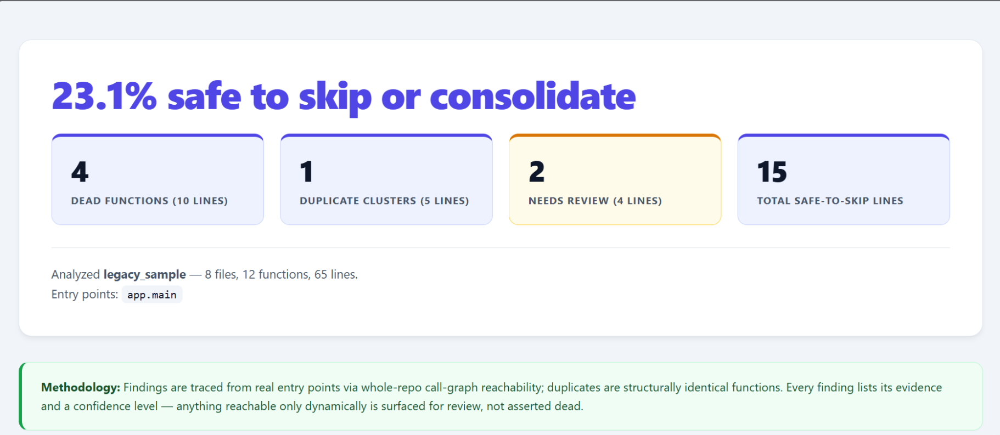
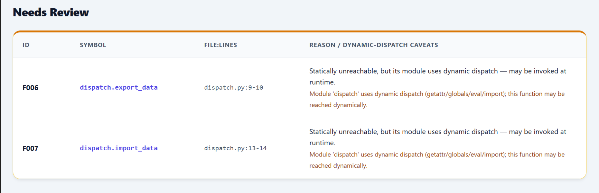
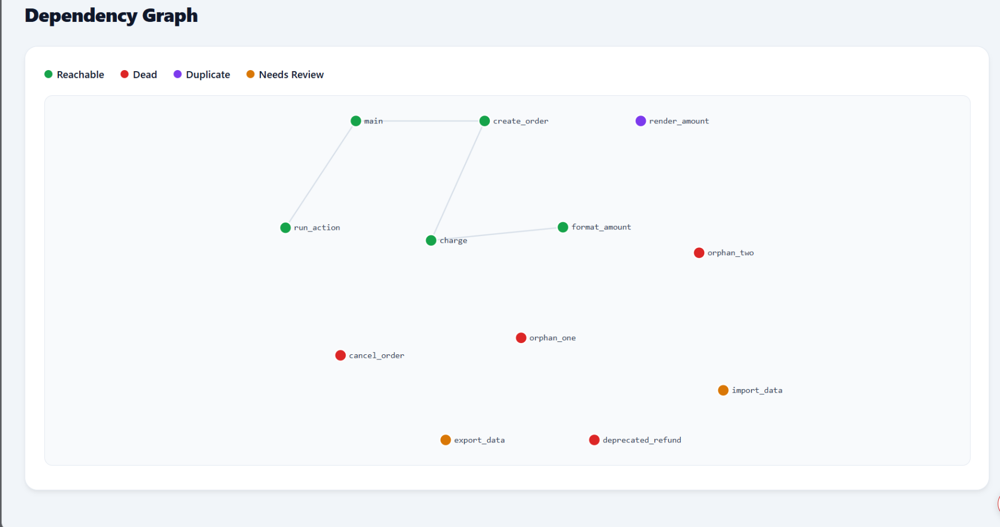
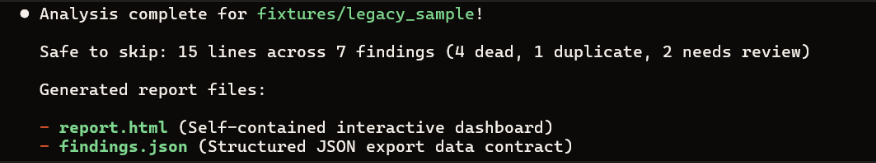
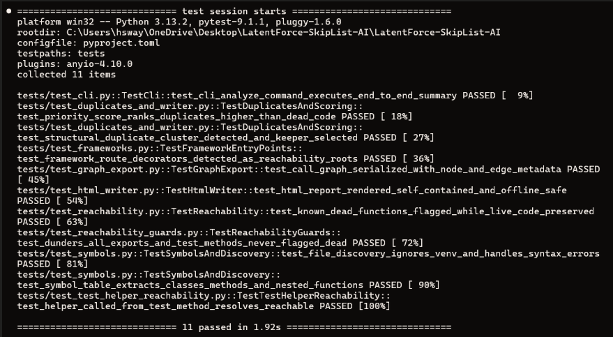

```text
 ____    _      _           _       _         _   
/ ___|  | | __ (_)  _ __   | |     (_)  ___  | |_ 
\___ \  | |/ / | | | '_ \  | |     | | / __| | __|
 ___) | |   <  | | | |_) | | |___  | | \__ \ | |_ 
|____/  |_|\_\ |_| | .__/  |_____| |_| |___/  \__|
                   |_|                            
SkipList v0.1.0 — Know what to skip before you migrate.
```

# SkipList (LatentForce-SkipList-AI)

> **Pre-Migration Code-Triage Engine:** Finds dead code and structural duplicates across legacy Python codebases so migration teams scope real work first.

---

## 📸 Overview & Visual Reports

| Hero Dashboard | Needs Review (Dynamic Dispatch) |
| :---: | :---: |
|  |  |

| Interactive Dependency Graph |
| :---: |
|  |

| CLI Triage Analysis Output | Verbose Claim-Based Test Suite Output (`pytest`) |
| :---: | :---: |
|  |  |

---

## 🎯 The Problem & What SkipList Does Differently

When migrating or modernizing legacy Python codebases, migration teams waste significant effort refactoring and rewriting code that is never executed at runtime or duplicating identical helper logic across multiple modules. Standard static linters often produce high numbers of false positives by asserting dynamically invoked functions dead.

**SkipList solves this by providing conservative, evidence-backed code triage:**
1. **Whole-Repo Call-Graph Reachability:** Builds a directed call graph across modules and traces reachability from real entry points (main functions, `if __name__ == "__main__":` guards, console scripts, web routes, CLI commands, and test discovery roots).
2. **Dynamic-Dispatch Credibility Mechanism:** Detects runtime reflection patterns (`getattr`, `setattr`, `globals()`, `locals()`, `eval`, `exec`, `importlib`). Statically unreachable code in dynamic modules is demoted to **`confidence = "low"`** ("Needs Review") with explicit caveats rather than falsely asserted dead.
3. **Test-Discovery Entry Points:** Automatically treats `test_*` functions, `unittest.TestCase` methods (`setUp`, `tearDown`, test cases), and `@pytest.fixture` functions as reachability roots so test helpers are never misflagged as dead.
4. **Structural Duplicate Detection:** Normalizes AST function nodes (stripping docstrings and standardizing parameter/variable names while preserving API surface) to group identical functions into duplicate clusters and select live keepers.

---

## 🛠️ Installation

```bash
python -m pip install -e .
```

---

## 🚀 Usage

### 📊 1. Codebase Triage (`skiplist analyze`)

Run a full triage analysis on a Python project and generate both interactive HTML dashboards and structured JSON exports:

```bash
skiplist analyze "C:\path\to\your\project" --format both --out report.html --frameworks
```

* **`report.html`:** Self-contained, offline-safe interactive dashboard featuring summary tiles, methodology guidelines, sortable findings tables, expandable evidence details, and an interactive SVG force-directed dependency graph.
* **`findings.json`:** Machine-readable data contract containing prioritized findings and serialized call-graph nodes/edges.

**Useful Flags:**
* `--frameworks`: Enable framework-aware entry point detection for `Flask`/`FastAPI` routes, `Click`/`Typer` commands, and `Celery` tasks.
* `--format {html,json,both}`: Specify report format (default: `html`).
* `--entry <dotted_name>`: Manually specify custom entry points (repeatable, e.g. `--entry my_app.main`).
* `--exclude <pattern>`: Skip specific file/folder patterns (repeatable, e.g. `--exclude "node_modules/*"`).

---

### 🔍 2. Symbol Table Generation (`skiplist symbols`)

List all defined functions, methods, and classes with line ranges and exact LOC:

```bash
skiplist symbols fixtures/legacy_sample
```

---

### ☠️ 3. Inspect Reachability & Dead Candidates (`skiplist deadcode`)

Inspect detected entry points and unreachable candidate symbols:

```bash
skiplist deadcode fixtures/legacy_sample --frameworks
```

---

### 🧪 4. Automated Test Suite (`pytest`)

Run the automated test suite with claim-based verbose output by default:

```bash
pytest
```

> **Guarantees verified by automated test suite:**
> * **Known-dead code is flagged** while live callers and entry points are preserved.
> * **Dynamically-dispatched code is downgraded to review** (low confidence), never asserted dead.
> * **Test infrastructure & helper functions are never falsely flagged** as dead code.
> * **Structural duplicate clusters are detected** and reachable keepers selected.
> * **Summary math & priority scores are deterministic** and contract-compliant.

---

## 🧪 Validation Results

### 1. Ground-Truth Fixture (`fixtures/legacy_sample`)
- **Files & LOC:** 8 files, 65 lines of code, 12 functions/methods.
- **Results:** 15 safe-to-skip lines (**23.1%**).
- **Accuracy:** Correctly identified 4 dead functions, 1 duplicate cluster (`legacy_format.render_amount` duplicating `formatting.format_amount`), and 2 needs-review dynamic-dispatch functions (`dispatch.export_data`, `dispatch.import_data`).

### 2. Real OSS Production Repo Validation (`bottle`)
- **Files & LOC:** 30 files, 9,192 lines of code, 946 functions/methods.
- **Execution Time:** ~0.5 seconds (zero crashes or hangs).
- **Results:** 2,309 safe-to-skip lines (**31.3%** safe to skip/consolidate) across 320 findings (265 dead code, 44 duplicate clusters, 11 needs review).
- **Scale Guard:** Automatically collapsed the 946-function graph to 30 file-level module nodes with status color aggregation (`14` green, `11` red, `2` purple) for performance and readability.

---

## ⚠️ Limitations & Known Gaps

1. **Nested Closures & Lambda Functions:** Call graph edge extraction currently tracks top-level module functions, async functions, and class methods. Nested closures and lambda functions defined inside function bodies are not yet fully mapped as separate call-graph nodes.
2. **Dynamic String Evaluation:** Calls executed via string evaluation or complex runtime monkey-patching without explicit module-level reflection markers may require manual review under the "Needs Review" category.

---

## 🧩 Agent Skill Declaration

* **SkillPatch Skill Used:** `pytest-skill` (`.latentcode/skills/pytest-skill/`)
* **Purpose:** Installed via SkillPatch to scaffold, structure, and validate the automated unit and integration test suite (`tests/`).

---

## 📜 License

MIT License
